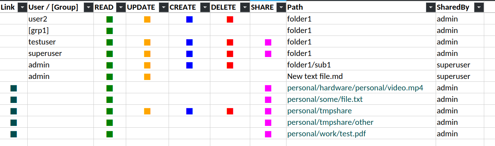

# nextcloud-list-shares



- [Features](#features)
- [Quickstart](#quickstart)
- [Create release](#create-release)
  - [Run release](#run-release)
- [How this project was built](#how-this-project-was-built)

## Features

- nextcloud postgres backend db access ( readonly )
- list share with
  - flag if the share is a link share
  - user or group that access the share
  - share permissions ( merged for user and usergroup )
  - fullpath of shared item
  - share by ( who created the share )

## Quickstart

- replace `DBHOST`, `DBNAME`, `DBUSER`, `DBPASS` in the follow with your own

```sh
git clone git@github.com:devel0/nextcloud-list-shares.git
cd nextcloud-list-shares
dotnet user-secrets set "ConnectionStrings:Cloud" "Host=DBHOST; Database=DBNAME; Username=DBUSER; Password=DBPASS"
dotnet run
```

- generated file will be in Desktop/shares.xlsx unless `--output=SOMEPATHFILENAME` specified

## Create release

- change `RUNTIMERID` with target platform: `linux-x64`, `win-x64`, `osx-x64`

```sh
dotnet publish -c Release --runtime RUNTIMERID --sc
```

published files will be in `bin/Release/net8.0/RUNTIMERID/publish/` ( there is no need to install dotnet on target platform thanks to `--sc` option )

### Run release

- add `--output=SOMEPATHFILENAME` argument to generate the file elsewhere than `Desktop/shares.xlsx`

- linux

```sh
ConnectionStrings__Cloud="Host=DBHOST; Database=DBNAME; Username=DBUSER; Password=DBPASS" ./nextcloud-list-shares
```

- windows (powershell)

```sh
dotnet publish -c Release --runtime win-x64 --sc
$Env:ConnectionStrings__Cloud="Host=DBHOST; Database=DBNAME; Username=DBUSER; Password=DBPASS"
```

## How this project was built

```sh
dotnet new console -n nextcloud-list-shares
```
